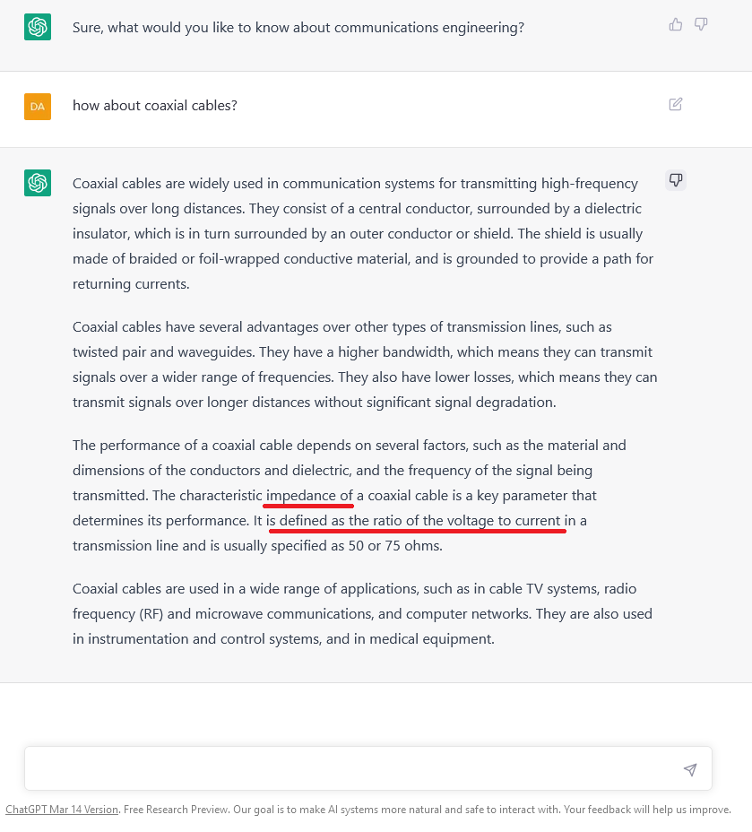

# Hinweise zur Anfertigung von Projekt- und Bachelorarbeiten

Bei der Lektüre von Projekt- und Bachelorarbeiten fallen mir regelmäßig identische Sachverhalte auf. Daher möchte ich an dieser Stelle eine kleine Zusammenstellung (ohne Anspruch auf Vollständigkeit) von Hinweisen zur Erstellung solcher Arbeiten geben.

Vorweg der Verweis auf die Seite der DHGE mit den Hinweisen zur Erstellung von Projekt-/Studien-/Bachelorarbeiten: https://www.dhge.de/DHGE/Fuer_Studierende/Hinweise-zur-Anfertigung-von-Arbeiten.html.

# AI / KI Tools
Aus meiner Sicht: Nutzen Sie die AI / KI Tools. 
- Diese Werkzeuge werden Ihre Arbeit nicht für Sie schreiben. Aber wahrscheinlich wird Ihr Text dadurch besser. z.B. weil Sie damit die Trümmerbrüche von Sätzen, die ich manchmal sehe, umformulieren können. Oder die Kommasetzung deutlich verbessern. Oder oder oder... im Endeffekt sind das Werkzeuge wie ein Taschenrechner oder die Rechtschreibkorrektur von Word. 
- Die geistige Leistung muss noch immer von Ihnen kommen. Aber Sie können sich auch das wichtige (Ihre Ideen) konzentrieren. Hinweis: Kollegen mögen das vielleicht anders sehen...
- Bei schlampiger Arbeit (Quellen / Abbildungen / dumme Ideen) helfen Ihnen die Tools auch nicht weiter. Deswegen ist auch die Quellenarbeit so wichtig!
- Aber *VORSICHT*: Hier ist mal ein Beispiel, warum Sie bei der Benutzung aufpassen müssen (und das Denken und die Verantwortung bei Ihnen bleiben):  

  
- Die Tools helfen auch bei der Quellenarbeit (dazu auch c't 11/23, S. 118 ff. über wiso-net.de zugänglich aus dem Hochschulnetz):  
 
  - [Semantic Scholar](https://semanticscholar.org/me/research): Hilft bei der Suche von Quellen.  
  
  - [Research Rabbit](https://www.researchrabbit.ai): Metasuche unter Einsatz mehrerer Suchmaschinen. Quellensammlungen erstellen. Visuelle Darstellung der Zitate von Quellen (wer zitiert wen?).  
  
  - [Explainpaper](https://www.explainpaper.com): Zusammenfassung von Artikeln. Vorsicht, ist halt KI, s.o.  
  
  - [ChatPDF](https://www.chatpdf.com): PDF hochladen, Fragen dazu stellen, erklärt kriegen. Vorsicht, ist halt KI. s.o.  
  

# Bewertungsblatt
- Die Arbeit ist eine Prüfungsleistung, die durch die Hochschule zu benoten ist. Das ist Voraussetzung dafür, dass Ihr Studiengang akkreditiert ist (und Sie einen Abschluss erhalten).
- Lesen Sie die linke Spalte des Bewertungsblattes. Dort sind die einzelnen Punkte aufgezählt, die für die Bewertung maßgeblich sind. Auch wenn Ihr betrieblicher Betreuer sagt, dass Sie etwas anderes tun sollten ("lassen Sie mal die kritische Bewertung weg..."): nein.
- Ich setze meine Unterschrift in der Eigenschaft als Angehöriger der Hochschule unter das Bewertungsblatt und stehe damit für die Korrektheit der Benotung entsprechend der Punkte auf dem Bewertungsblatt.

# Grafiken
- Benötigen eine Auflösung von mindestens 300dpi um für den Druck geeignet zu sein.
- Sollten nicht als JPG vorliegen, denn das erhöht die Gefahr durch zu starke Kompression Details zu verlieren. Versuchen Sie es mit PNG oder noch besser einem Vektorformat wie SVG. Bei selbst erstellten Grafiken haben Sie das ja in der Hand.
- Codeschnipsel sollten nicht als Grafiken eingefügt werden. Screenshots sind dafür gänzlich ungeeignet. Versuchen Sie es mit einer Hervorhebung durch entsprechende Formatierung.
  - Um Syntax-Highlighting in Word zu realisieren, kann diese beispielsweise sehr gut [aus Notepad++ übernommen werden](https://superuser.com/a/39600/1239582)
  - Alternativ gibt es (danke an einen Studenten!) auch highlight.me als Webdienst. 
- Auch "vom Internet inspirierte" Grafiken müssen mit Quellenangaben versehen werden. Die Idee einer Grafik mit anderen Icons zu realisieren ist nicht gut. 
- Die Sprache des Ingenieurs ist die Zeichnung. Quellcode wird mit einem Flussdiagramm viel verständlicher. Das gilt auch für Prozessschritte. Auch Interaktionen zwischen Komponenten einer Schaltung / eines Softwarepakets lassen sich durch ein Diagramm ohne viele Worte darstellen.
- Screenshots haben bei den heutigen Anzeigen mit hoher Auflösung die Angewohnheit recht kleine Schriftbilder aufzuweisen. Das ist dann schwer lesbar. Und noch schwerer lesbar sind die beknackten Dark Mode Screenshots. Himmel. Nur weil etwas hip ist, heißt das nicht, dass es gut ist. Stellen Sie für Screenshots doch bitte größere Schrift unter Windows ein und machen Sie den Dark Mode aus.
- Bei Screenshots dürfen Sie ruhig die relevanten Bereiche kennzeichnen (Box drum, am besten in Farbe). Oder den relevanten Bereich nochmals "zoomen".

# Rechtschreibung und Grammatik
- Für eine Eins müssen Rechtschreibung und Grammatik fehlerfrei sein. Keine Sorge, dafür gibt es Hilfsmittel in Word, die Sie einfach nur anschalten müssen. 
- Scheuen Sie sich nicht, Ihre Arbeit einem Kommilitonen/in zur Lektüre zu geben. Da erhalten Sie wertvolle Hinweise.
- Die Ich-Form ist sehr, sehr unüblich.
- Sätze wie Hammerschläge. Was meine ich damit? Lassen Sie Füllwörter weg. Jeder Satz sollte eine wichtige Aussage beinhalten. Wenn nicht, ist er überflüssig und kann gestrichen werden.
- Abkürzungen: Begriffe schreiben Sie bei der ersten Erwähnung aus und stellen die Abkürzung danach in Klammern. Zusätzlich nehmen Sie die Abkürzung in der Abkürzungsverzeichnis auf. ("Das Internet Protocol (IP)...."). Damit hat der Leser bei der Lektüre die Abkürzung vor Augen. Falls er sie trotzdem bis zur nächsten Erwähnung vergessen haben sollte gibt es das Abkürzungsverzeichnis zum Nachschlagen.
- Prüfen Sie auf Vergangenheitsformen ("dann musste ... erledigt werden..."): Wenn Sie diese finden ist das oft ein Hinweis auf einen Erzählstil. Das ist für eine wissenschaftliche Arbeit auch sehr unüblich. Also weg damit. Lieber eine Darstellung der Herausforderungen und dann können Sie erklären, wie Sie diese überwunden haben. Das ist ja Ihre Leistung.

# Argumentationsketten
- Ein bewährtes Schema ist der Dreiklang aus "Darstellen", "Bewerten" und "Folgern". Was soll das bedeuten? Am Beispiel einer Modellbildung:  Darstellen ("das Modell ist linear und hat nur die Widerstandswerte der Heißleiter als Eingangsgrößen") - Bewerten ("weil wir weder Geometrie noch Zeiteinflüsse abbilden ist das doof" - Folgern ("das müssen wir anders machen, ich habe da eine Lösung in dieser Arbeit").
- Mit diesem Dreiklang vermeiden Sie, dass Sie zuerst etwas schreiben und dann die Begründung dafür kommt. Da fühle ich mich als Leser irgendwie nicht so richtig wohl, weil ich mir immer denke "jetzt hat er/sie sich noch 'ne Begründung dazugebastelt..". Und üblicherweise ist es ja so, dass man ein Problem hat (das wird im "Darstellen" beschrieben), dann denkt man sich seinen Teil zu möglichen Lösungen ("Bewerten") und kommt dann zu einer guten Lösung ("Folgern").

# Einordnung
- Das eigene Tun/die eigene Leistung muss in einen Kontext gerückt sein. Leitfragen: "Warum habe ich das so gemacht?", "Was sind die Vor-/Nachteile meiner Lösung?", "Wie hätte man das Problem sonst lösen können? Was sind die Alternativen?", "Warum haben wir die Alternativen nicht gewählt?", "Was bleibt noch an Arbeit zu tun? Wo sind Anknüpfungspunkte für weitere Arbeiten?"

# Eigene Leistung
- Dinge, die ich im Internet oder sonstwo nachlesen kann sind für Ihre Arbeit nicht wichtig. 70% der Seiten für Wiedergabe bekannter Sachverhalte und 30% für die eigene Leistung sind bestenfalls eine Drei. Andersrum (70% eigene Leistung und 30% Einleitung/Schluss) ist es angemessen.  
- Am Ende muss der Text nochmal bluten. Gehen Sie kritisch an Ihr Werk und fragen Sie, ob das was Sie gerade lesen wirklich in Ihrer Arbeit stehen muss. (Siehe auch "Sätze wie Hammerschläge")

# Quellen
- Seiten wie "ip-insider.de" und "security-insider.de" sind reine Werbung (schauen Sie mal ins Impressum). Damit fallen sie als Quellen aus. Prüfen Sie Ihre Quellen.
- Sekundärliteratur ist doof. Wenn Sie zu Grundlagen des Internet zitieren, nehmen Sie doch einfach mal die Dokumente der IETF und nicht das "Elektronik Kompendium".- 
- Behauptungen ("50% aller Unternehmen wurden bereits Opfer einer Cyber-Attacke...") bleiben einfach nur Behauptungen wenn sie nicht durch eine Quelle hinterlegt sind.
- Führen Sie nur Fakten aus Quellen an, die Sie auch verstanden haben. Wenn Ihnen etwas unklar ist, fragen Sie bei Ihrem betrieblichen Betreuer (oder mir, falls ich Ihr Betreuer von Seiten der Hochschule bin) nach.
- Wenn Sie schon nicht in die Bibliothek zur Suche von Büchern gehen wollen: Verwenden Sie doch bitte nicht die normale Google Suche. Es gibt eine [Spezialsuche für wissenschaftliche Arbeiten von Google](https://scholar.google.de). Dann bleibt so ein Unsinn wie xxx-insider.de außen vor.
- Verdammt nochmal, fangen Sie doch bei der Einleitung direkt mit Quellenarbeit an. Gerade dort. Da schreiben Sie ja in den seltensten Fällen irgendwas Neues (das von Ihnen stammt). Insofern muss da quasi jeder Satz mit einer Quellenangabe hinterlegt sein (oder zumindest jede Aussage, die sich ggfs. ja auch auf mehrere Sätze verteilen kann).

# Fußnoten
- Doppelte Fußnoten am Ende eines Satzes fassen wir zu einer einzigen zusammen.

# Abwesenheiten und Urlaub
- Die Erstellung der Bachelorarbeit fällt in die Sommerzeit. Da kann es schon passieren, dass Betreuer und Ansprechpartner im Urlaub sind. Lassen Sie also einen Puffer für solche Fälle.

# offensichtlicher Unsinn
- Führt zu Abzügen in der Benotung. 
- Als Beispiel (umschrieben, um niemanden an den Pranger zu stellen, der Sinn ist aber erhalten): "Wir implementieren keine Verschlüsselung und wechselseitige Authentifizierung der Kommunikationspartner weil das eine Neuzulassung unseres Produkts verursacht." Das war in einer Arbeit, die sich mit IT-Sicherheit beschäftigt hat. Geht's noch??? 

# Formalitäten
- Alles, was Sie an formalen Voraussetzungen (Anzahl Exemplare,...) wissen müssen, ist auf den [Seiten der DHGE zur Anfertigung von Arbeiten](https://www.dhge.de/DHGE/Fuer_Studierende/Hinweise-zur-Anfertigung-von-Arbeiten.html) zu finden.

# Verlängerung
Die Bachelorarbeit fertigen Sie kurz vor dem Ende Ihres Studiums an. Die Betonung liegt auf kurz. Was passiert, wenn sich die Bearbeitung des Themas verzögert, können Sie sich ja vorstellen. Eine Verlängerung der Bearbeitungszeit ist daher nicht vorgesehen.   
Ggfs. (z.B. aus gesundheitlichen Gründen) kann eine Verlängerung dennoch gewährt werden. Dafür ist ein vom betrieblichen Betreuer unterzeichnetes Schreiben (keine reine Mail, kann aber gescannt und vorab per Mail gesendet werden) an den Studienrichtungsleiter erforderlich. Und bitte: Stichhaltige Gründe. Sowas nach dem Motto "die Hardware kam halt nicht..." reicht nicht aus. Und denken Sie an die Urlaubszeit!
